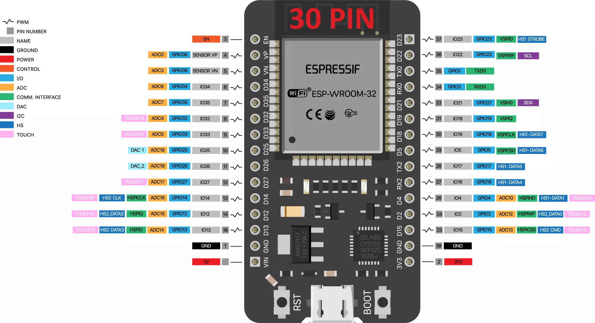

# Muscle Monitor
A muscle intensity sensor with ESP32, speaker and a MAX7219 led bar

## ESP32

## Barra Led MAX7219
| ESP32 | MAX7219 |
| ----- | ------- |
| VIN   | VCC     |
| GND   | GND     |
| D23   | DIN     |
| D15   | CS      |
| D18   | CLK     |

## Altavoz
| ESP32 | Speaker |
| ----- | ------- |
| D35   | Red     |
| Gnd   | Black   |
## Keypad

| ESP32 | Keypad    |
| ----- | --------- |
| D26   | COL PIN 1 |
| D25   | COL PIN 2 |
| D33   | COL PIN 3 |
| D13   | ROW PIN 1 |
| D12   | ROW PIN 2 |
| D14   | ROW PIN 3 |
| D27   | ROW PIN   |

 ## Keypad Codes
 * **"#\<num\>#"**: Load saved value from <num>.
 * **"\*\<num\>\*"**: Delete saved value from <num>.
 * **"\*#\*"**: Delete all saved values.
 * **"\*\*\*"**: End program loaded

## EMG Sensor

| ESP32 | EMG   | 
| ----- | ----- | 
| D13   | S Out | 
| GND   | GND   | 